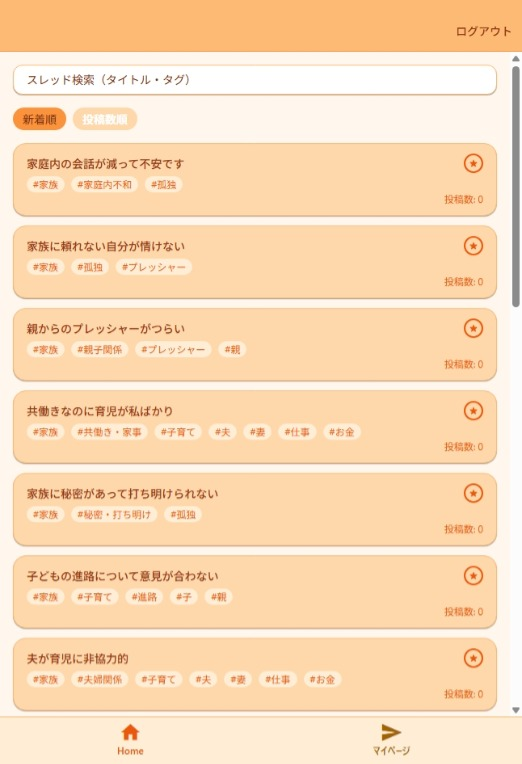
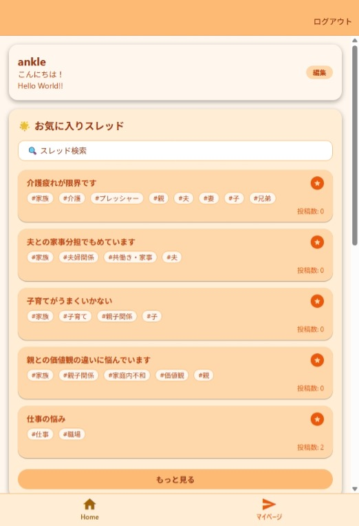
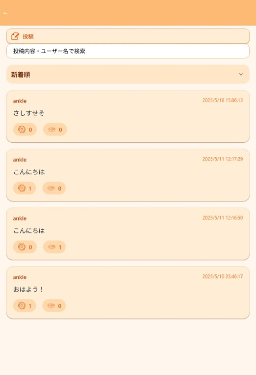
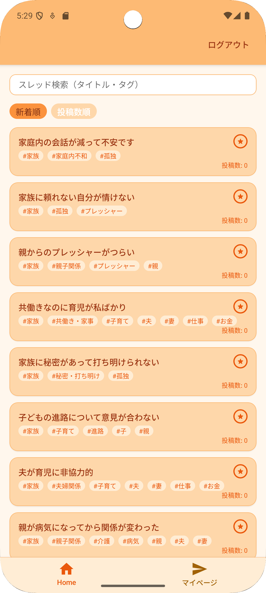

# Uchimo 
**悩みを分かち合う、優しいSNS**


## 概要

**Uchimo** は、「オンライン上のグループカウンセリング」をコンセプトとした SNS アプリです。  
投稿は「悩みのカテゴリ別スレッド」に分類され、返信やDM機能はあえて排除し、共感リアクションのみが得られる安心感のある交流体験を提供します。
また、同一スレッドの一日の一人当たりの投稿数を1回に制限することで、グループカウンセリングとしての体裁を整えています。

このリポジトリでは、React Native（Expo）および Firebase を用いたユニバーサルアプリのフロントエンドコードを管理しています。

---

## 主な機能

- スレッド一覧の取得・表示（新着順 / 投稿数順の並び替え）
- スレッドの検索（タイトル・タグ）
- お気に入り登録（ブックマーク機能）
- 無限スクロールによるスレッドの追加取得
- ログインユーザーに応じたフィルター・表示切替
- Firebase Firestore との連携（データ取得・書き込み）

---

## 技術スタック

| 項目 | 技術 |
|------|------|
| フレームワーク | React Native + Expo |
| 状態管理 | React Hooks (`useState`, `useEffect`, `useMemo`, etc.) |
| ルーティング | `expo-router` |
| バックエンド | Firebase Firestore / Firebase Authentication |
| UI | Tailwind CSS for React Native (via `className` with NativeWindなど想定) |

---


##　ディレクトリ構成（抜粋）

```
/components
  └─ AnimatedBookmark.tsx     // お気に入りアイコンのアニメーション
/hooks
  └─ useProtectedRoute.ts     // 認証状態のルーティング保護
/lib
  └─ firebase.ts              // Firebase 初期化
/screens
  └─ HomeScreen.tsx           // スレッド一覧画面（本コード）
```

---


## 作者

- 名前: 今吉明日翔（Asuka Imayoshi）  

---

## スクリーンショット（例）
- ホーム画面

- マイページ画面

- スレッド画面

- Android版画面


